# **Project Joopgging **

## Project Joopggng Notion 

## 📺 시연영상

## 📅 제작기간 

* 2021년 10월 25일 ~ 2021년 12월 04일 (6주)

## 💃 팀원소개 🕺

## 👨🏻‍💻 Front-end (React) 

  * 최재환 🧔
  * 김재용 👨
  * 안정우 🧔

## 🧑🏽‍💻 Back-end (Spring) 

  * 이재성 🧔 (팀장)
  * 남우식 👨
  * 김선겸 🧔

## 🎨 Designer 

  * 한은현 👩
  * 김민지 👧

### 🔧 사용 기술 

            

### 💬 커뮤니케이션 툴

- GitHub
- Slack
- Gather

## **1.프로젝트 소개**
프로젝트 소개 완벽한 플로깅 파트너

원하는 지역에서 원하는 거리, 장소를 정하여

같은 뜻을 가진 사람들과 함께 플로깅을 할 수 있는 맞춤형 서비스 **"줍깅" !**

줍깅을 통해 사람과 소통하고 지구에 생명을 불어넣는 **함께하는 세상**을 만들어가요 !

그리고 줍깅을 이용할 때마다 **줍깅러들을 축하해주는 뱃지**들도 만나보아요! :)

## **2. 기획배경, 타겟층**
최근 몇년 새 MZ세대를 중심으로 운동과 환경을 함께 생각하는 그리너리/에코 챌린지 및 활동이 활발해졌습니다.더불어 생소했던 플로깅에 대한 인식 확산으로 단체/기업 등 홍보 차원의 플로깅 캠페인 역시 활성화 되고 있습니다.

그러나 대부분 홍보 목적이나 단발성 이벤트에 그치고 있어 개인이 직접 모임을 만들어 활동하긴 어려웠고 이로 인해 플로깅이 활성화 되기엔 제약이 있다고 생각했습니다. 그리하여 기존의 한계를 극복하고 플로깅을 한층 더 활성화하기 위해 플로깅 모집/소통이 가능한 플랫폼 개발 구상을 하게 되었습니다.

저희는 산발적으로 흩어져 있는 플로깅 참여자를 한 곳에 모집해주고 소통할 수 있는 커뮤니티를 지원하며, 모임 참여자, 주최자 구분없이 다양하고 보다 많은 참여자를 유입 가능하게 하여 "플로깅 참여의 장" 을 만들고 싶었습니다.

따라서 웹에서 쉽고 간편하게 모임 생성 및 관리, 참여 등을 가능하게 하여 유저친화적UI/UX 접근성이 높은 커뮤니티 플랫폼을 목표로 개발하였습니다.

## **3. 사이트맵**
사이트 맵 분석을 통해 서비스 콘텐츠 중심으로 웹 페이지의 전체 구조를 계층적으로 파악했습니다.

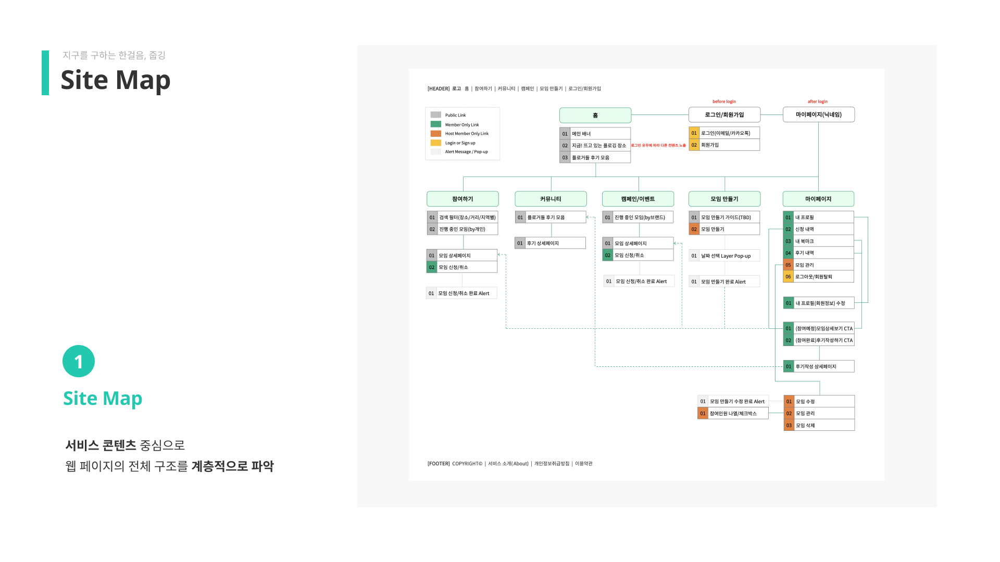
## **4. 정보 구조도**
와이어 플로우 중심으로 웹 페이지의 전체 구조를 세부적이고 체계적으로 파악했습니다.

## **5. 유저 플로우**
플로우 차트 제작을 통해 전체 웹 페이지 화면을 사용자의 행동과 이용 흐름을 중심으로 개별적이고 단
계적으로 파악했습니다.
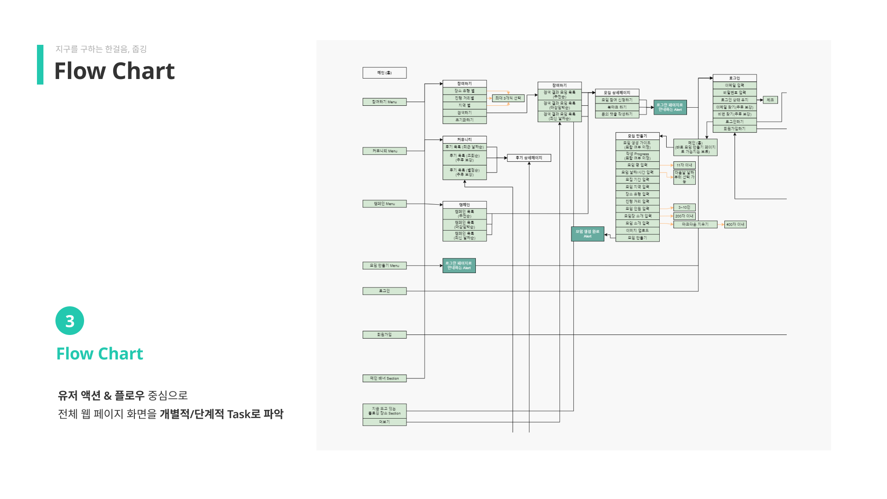
## **6. 와이어 프레임**
그 결과, 와이어 프레임 단계에서부터 콘텐츠와 사용자 흐름을 바탕으로한 디자인 설계가 가능했습니다.
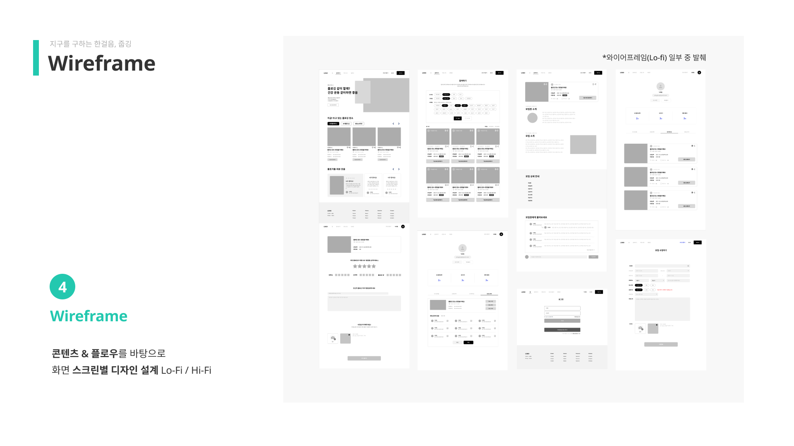
## **7. 프로젝트 아키텍처**
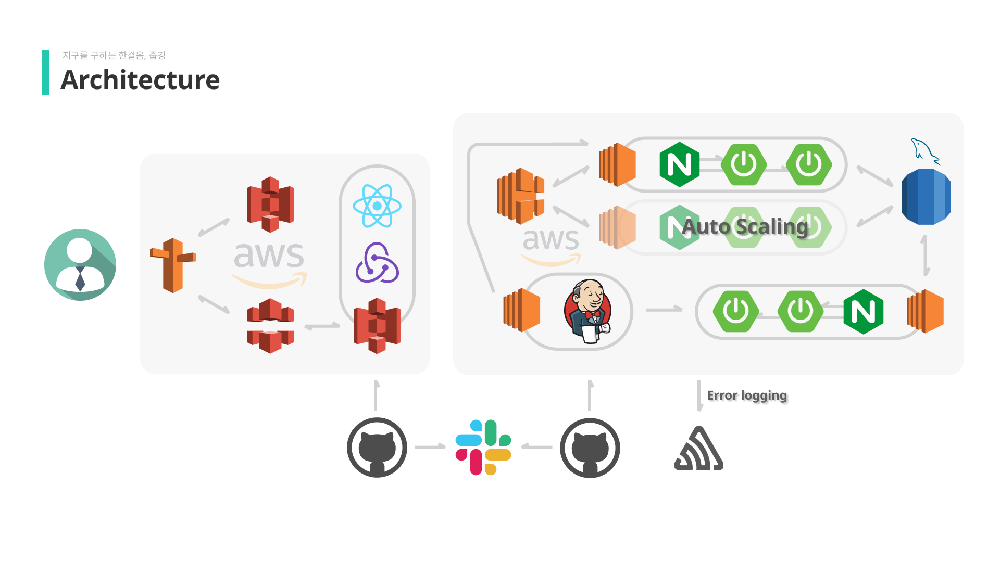
## **7-1. 프론트 엔드 아키텍처**
 프론트 엔드는 사용자 인터페이스 구축을 위해 리액트 라이브러리를 이용하였습니다. 상태관리
툴로는 리덕스를 채택했고, 아마존 S3와 클라우드 프론트를 이용해 배포하였습니다. 이미지 저장소는
개별 S3 버킷을 두어 관리하였습니다.
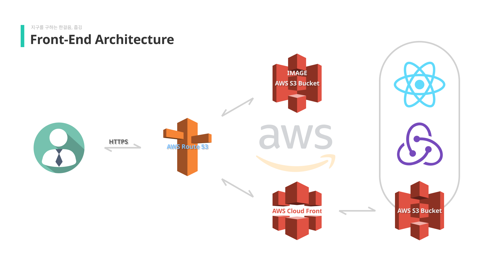
## **8. 프론트 엔드 기술 챌린지**
 프론트엔드에서는 HTTPS 구현을 위해 클라우드 플레어와 아마존 웹서비스의 클라우드 프론트 두 가지 방법을 고려했었는데요, 
 
 프로젝트 타임라인을 고려하여 둘 중 비교적 참고할 레퍼런스 자료들이 많은 클라우드 프론트를 이용해 HTTPS를 구현했습니다.
 
 그러나 라이트하우스 성능 점수가 저조함을 발견했고, 퍼포먼스 향상을 비롯한 전반적인 서비스의 개선을 위해 클라우드 플레어로의 이전을 선택했습니다. 
 
성능 향상은 물론이고 비용절감과 자동배포의 용이성까지 갖춘 클라우드 플레어는 많은 장점을 가졌습니다.

그러나, 줍깅 웹 사이트의 참여하기 페이지 한 곳만 동작하지 않는 심각한 오류가 발생했습니다. 

결국 최종 배포는 기존 아마존 웹서비스의 클라우드 프론트로 진행하게 되었고, 지속적인 트러블 슈팅을 통해 빠른 시일 내로 클라우드 플레어에 재배포할 예정입니다.

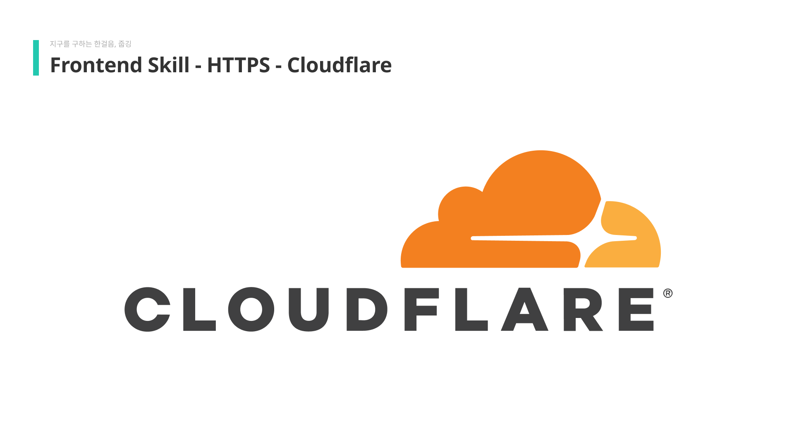
***
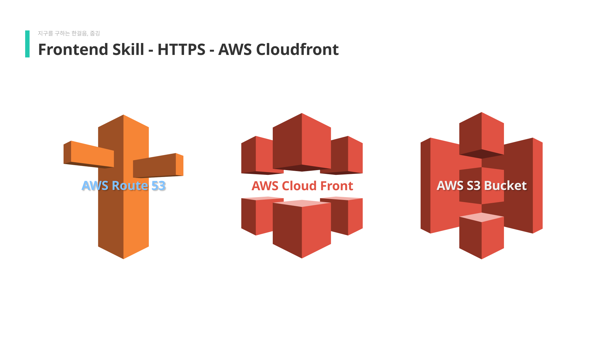
***
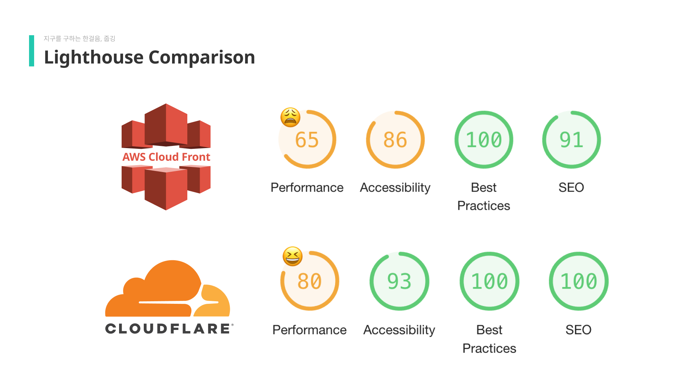
***
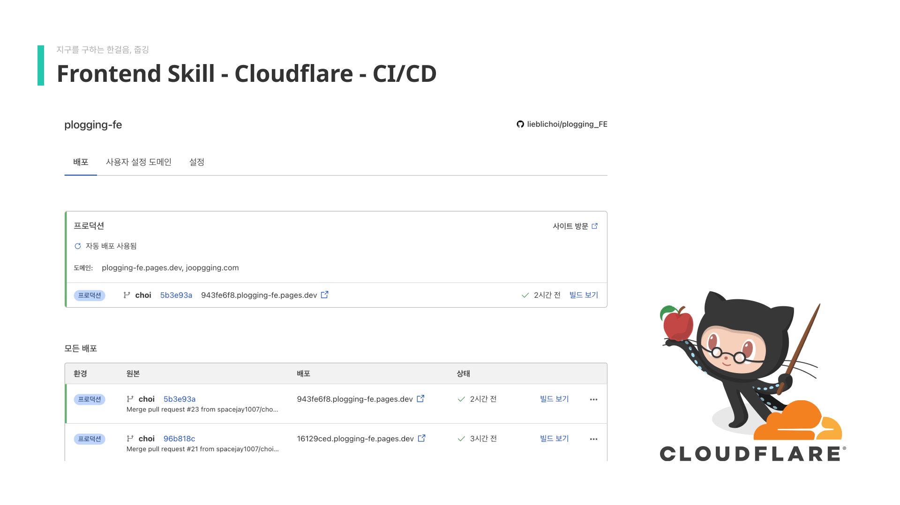
***

## **9. 설문조사 결과**
위와 같은 노력으로 저희 줍깅 서비스는 성공적으로 배포되었습니다. 감사하게도 많은 분들이 줍깅 서
비스를 이용해주셨고 다양한 피드백까지 남겨주셨는데요, 특히 서비스에 대한 전반적인 만족도와 편의
성이 높게 나타났습니다. 저희 개발진은 유저분들의 반응에 따라 높은 재방문율을 기대하고 있으며, 개
발 단계에서 더욱 적극적으로 사용자 피드백을 적용하여 서비스 고도화를 이어나갈 예정입니다.
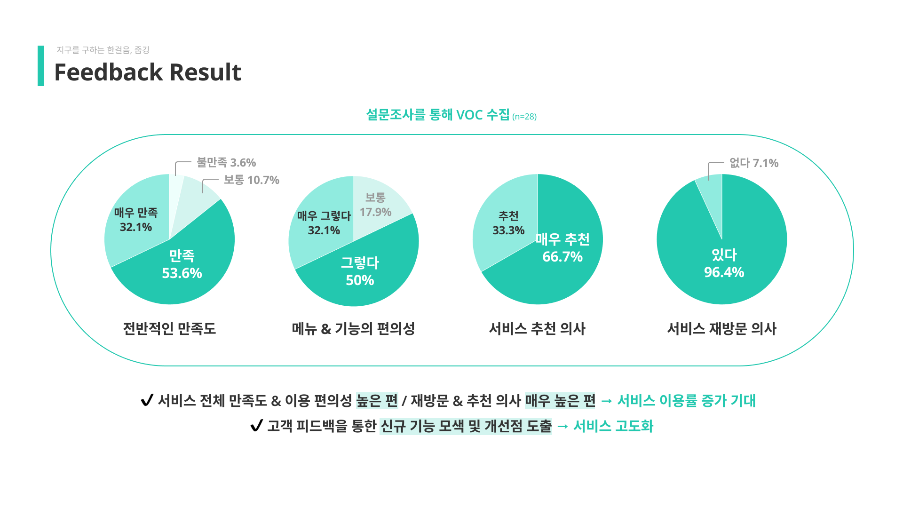
## **10. 유저 피드백**
첫번째 피드백을 통해 사용자분들께서 겪으셨던 회원정보수정 단계에서의 불편함을 개선했습니다. 

유저분들께서 개선된 기능을 빠르게 접하실 수 있도록 개발 단계를 나누어

개선이 완료된 부분을 먼저 적용했고, 개선된 기능에 대한 안내 문구도 함께 기재하였습니다.
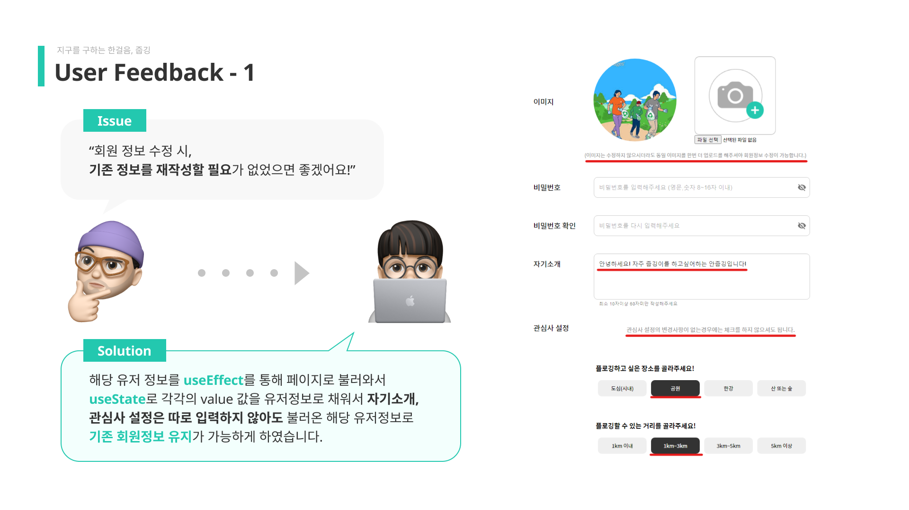
***
뱃지의 획득 기준을 알 수 없다는 피드백을 반영하여 유저분들이 해당 정보를 직관적으로 확인하실 수
있게끔 개선하였습니다.
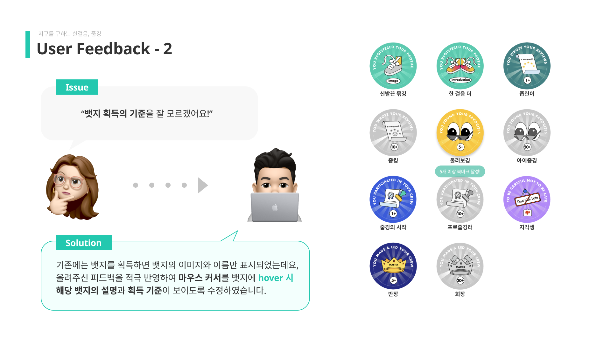
## **11. 마치며..**
저희는 프로젝트 전반에 걸쳐 역할에 구애 받지 않고 협업을 진행했습니다. 서로 맡은 일이 다르더라도
지속적인 피드백을 주고 받았으며, 결과적으로 모든 팀원이 원했던 결과를 만들어 낼 수 있었습니다.
6주 간의 프로젝트를 통해 기본적인 역량을 다지는 것을 넘어 새로운 도전을 할 수 있었습니다. 
백과 프론트 간의 협업 뿐만 아니라 디자이너와 개발자 간의 소통 또한 매우 중요하다는 것을 느꼈고, 더
욱 소통에 적극적으로 임했습니다.
기술적인 부분을 넘어 프로젝트 전반적으로 참여할 수 있는 좋은 기회였고, 이를 통해 한층 더 성장했음
을 느꼈습니다.
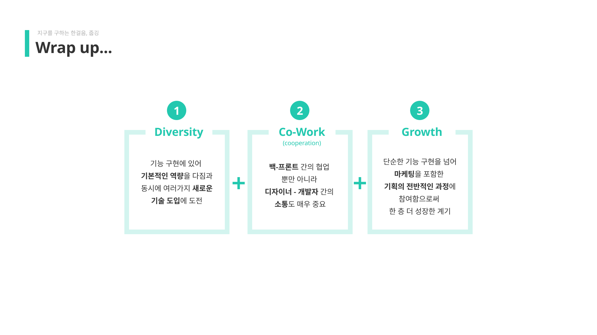

